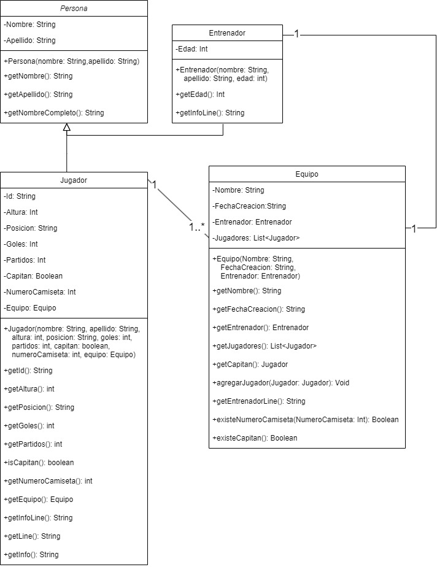

# Fut5App

Fut5App es una aplicación en Java desarrollada como proyecto de estudio para el curso de Java del Informatorio. Permite cargar y administrar equipos de fútbol 5, así como sus jugadores y entrenadores.

## Diagrama de clases

Aquí se encuentra el diagrama de clases que representa la estructura del proyecto:

## Funcionalidades

- Crear un equipo, sus jugadores y entrenador.
- Buscar un jugador por su nombre, donde se muestra el nombre, apellido, posición, si es capitán o no y el nombre de su equipo.
- Buscar un equipo por su nombre, donde se muestra el nombre, nombre del entrenador y nombre del capitán del equipo.
- Mostrar un equipo por su nombre, donde se muestra el nombre, nombre del entrenador y la lista de los jugadores del equipo.
- Eliminar un equipo dado su nombre.
- Mostrar un equipo por su nombre, donde se muestra el nombre, nombre del entrenador y la lista de los jugadores del equipo ordenados por su nombre.
- Mostrar un equipo por su nombre, donde se muestra el nombre, nombre del entrenador y la lista de los jugadores del equipo ordenados por número de camiseta.
- Mostrar un equipo por su nombre, donde se muestra el nombre, nombre del entrenador y la lista de los jugadores del equipo ordenados por su posición y número de camiseta.
- Importar la lista de jugadores de un equipo desde un archivo CSV o TXT.
- Exportar la lista de jugadores hacia un archivo, ya sea CSV o TXT.
- Asignar controles a los datos ingresados por teclado, por ejemplo, para evitar números de camiseta no disponibles o asignar más de un capitán por equipo. El sistema mostrará una alerta por pantalla y pedirá que se ingrese nuevamente el dato.
